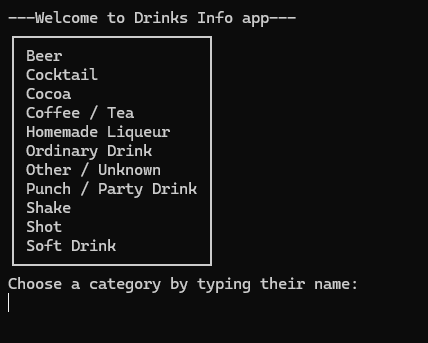
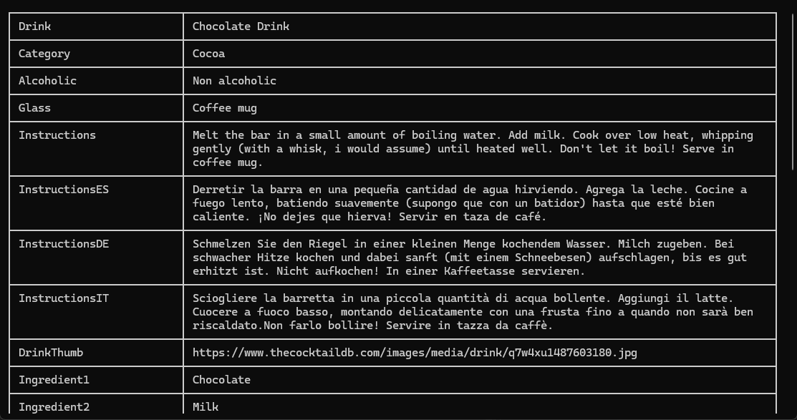
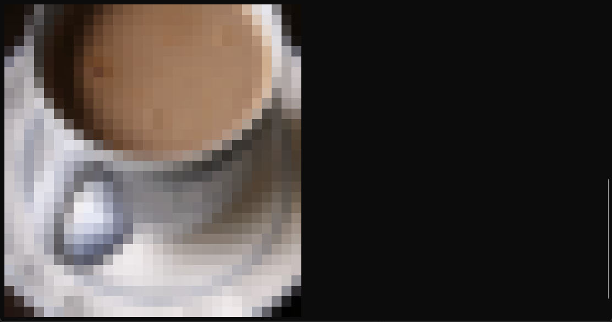
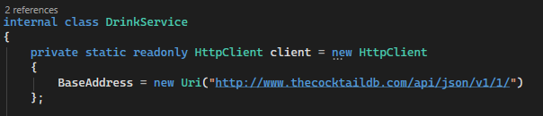
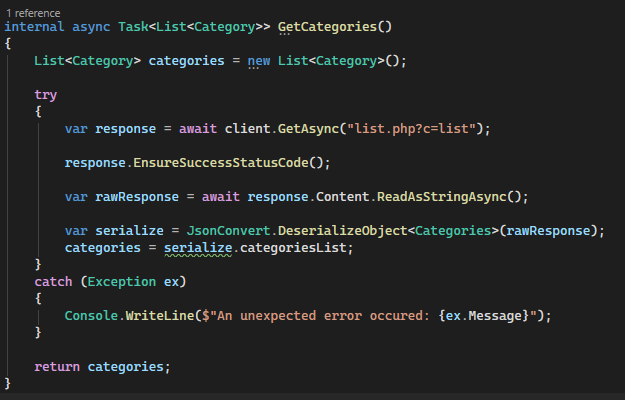
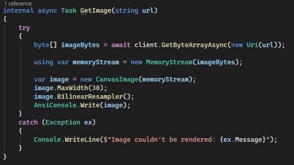

# Drinks Info
Drinks Info app is the second olive green belt project from the C# Academy. This project introduce me to the use of retrieving data from third-party data known as Web APIs (Application Programming Interfaces). The app basically showcase a pre-made web database that contains information about drinks. I programmed using C# with packages like Newtonsoft.json, Spectre.Console, Spectre.Console ImageSharp and with Visual Studio 2026. I follow the youtube tutorial below as the base of the project and then tackle some of the challenges afterwards.

## Requirements
- Their drinks menu is provided by an external company. All the data about the drinks is in the companies database, accessible through an API.
- Create a system that allows the restaurant employee to pull data from any drink in the database.
- When the users open the application, they should be presented with the Drinks Category Menu and invited to choose a category. Then they'll have the chance to choose a drink and see information about it.
- When the users visualise the drink detail, there shouldn't be any properties with empty values.
- Handle Errors so that if the API is down the application doesn't crash.

## Features
- Uses a Web API database pulled from "http://www.thecocktaildb.com/api/json/v1/1/" using HTTP Client.
- User chooses the category of drink in the beginning, then choose their drink for details. Table layout uses Spectre.Console. 

- Drink information will leave out the empty values and laid out in a table. Table layout uses Spectre.Console.

- Image display at the end of the table. Uses the Spectre.Console.ImageSharp component.

## Challenges
- The tutorial uses RestSharp to get the API databases. For the challenge, I try to use the HTTP Client from the beginning instead. Unfortunately I had to use Google Gemini to explain the HTTP Client fundamentals. From what I understood, first thing to do is to set up the base address to the HTTP Client.

Once that's done, the first part is to combine the base address with the uri to send a get request. Second part is to check if the response is successful. If it is sucessful, the response is then read as a string, and since the raw response is JSON layout, I use newtonsoft.json deserialization to convert into a model similar to the video tutorial. 

- Second challenge is to display images of the drinks, which all the drinks have as a link within their database. Displaying images on the console sounds impossible but luckily Spectre.Console has component that can render images called CanvasImage. However the challenge is that I always get an error when trying to set the image bytes directly to the CanvasImage. Google gemini points that I require a memory stream, which is an instance of the byte array that can be used in the CanvasImage.

## Resources Used
- https://www.youtube.com/watch?v=fc7peZ-FHs4
- https://learn.microsoft.com/en-us/dotnet/fundamentals/networking/http/httpclient
- https://spectreconsole.net/console/widgets/canvas-image
- Google Gemini